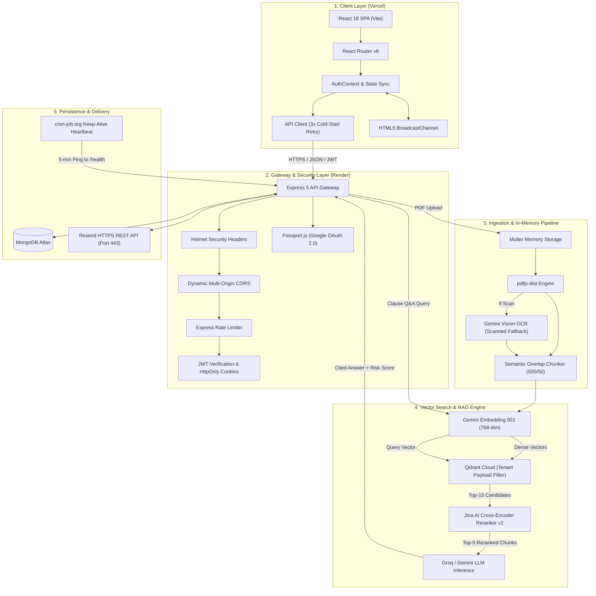
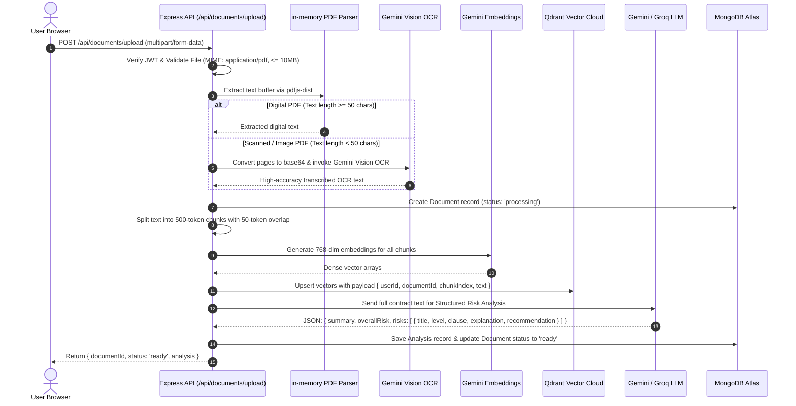
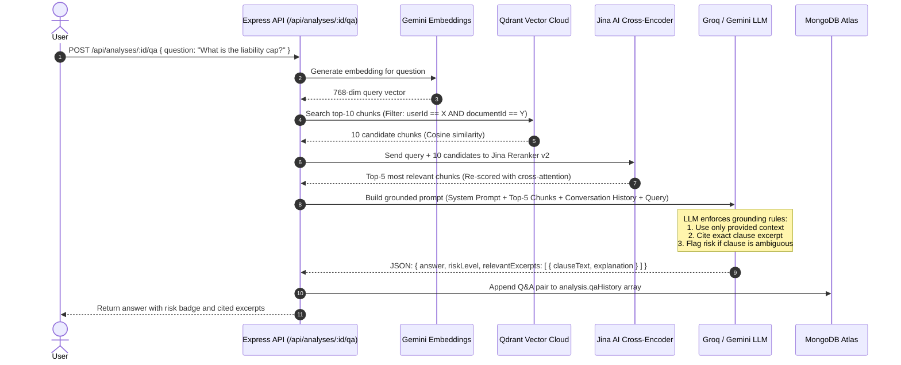
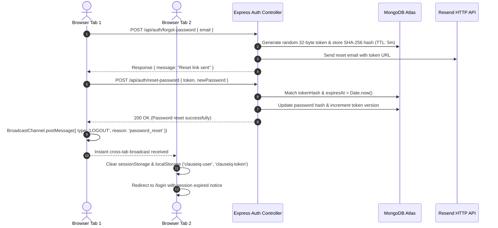

# ClauseIQ — System Architecture & Technical Deep-Dive ⚖️🏗️

> **Interview & Engineering Reference**: Comprehensive architectural blueprint, component interactions, RAG pipeline mechanics, security protocols, and engineering trade-offs of the ClauseIQ platform.

---

## 📋 Table of Contents
1. [Executive Summary & System Overview](#1-executive-summary--system-overview)
2. [End-to-End System Architecture Diagram](#2-end-to-end-system-architecture-diagram)
3. [Component Breakdown](#3-component-breakdown)
   - [3.1 Frontend Client (React SPA)](#31-frontend-client-react-spa)
   - [3.2 Backend API Gateway (Node.js & Express)](#32-backend-api-gateway-nodejs--express)
   - [3.3 AI, LLM & Embedding Pipeline](#33-ai-llm--embedding-pipeline)
   - [3.4 Database & Storage Layer (MongoDB & Qdrant)](#34-database--storage-layer-mongodb--qdrant)
   - [3.5 Email & Notification Subsystem (Resend API)](#35-email--notification-subsystem-resend-api)
4. [Core Workflows & Data Lifecycles](#4-core-workflows--data-lifecycles)
   - [4.1 Contract Ingestion & OCR Fallback Pipeline](#41-contract-ingestion--ocr-fallback-pipeline)
   - [4.2 Two-Stage RAG Q&A Engine (Retrieval + Jina AI Reranking)](#42-two-stage-rag-qa-engine-retrieval--jina-ai-reranking)
   - [4.3 Authentication, Session Sync & Cross-Tab Invalidation](#43-authentication-session-sync--cross-tab-invalidation)
5. [Database Schemas & Data Modeling](#5-database-schemas--data-modeling)
6. [Key Engineering Decisions & Trade-Offs (Interview POV)](#6-key-engineering-decisions--trade-offs-interview-pov)
7. [Security, Fault Tolerance & Cold-Start Resilience](#7-security-fault-tolerance--cold-start-resilience)

---

## 1. Executive Summary & System Overview

**ClauseIQ** is an enterprise-grade AI legal contract analysis platform that automatically inspects complex legal agreements (PDFs), extracts critical clauses, classifies commercial and legal risk severities (High, Medium, Low), and powers an interactive, hallucination-resistant Q&A engine grounded in exact document excerpts.

### High-Level Metrics & Capabilities:
- **Zero-Storage In-Memory Parsing**: PDFs are processed in volatile memory buffers with `pdfjs-dist` (and Gemini Vision OCR for flat scans), ensuring high privacy compliance and zero disk residue.
- **Dense Vector Search with Cross-Encoder Reranking**: 768-dimensional embeddings (`gemini-embedding-001`) indexed in Qdrant Cloud, refined by Jina AI's multilingual cross-encoder reranker (`jina-reranker-v2-base-multilingual`) to eliminate semantic cosine blindness in legal negation.
- **Resilient Distributed Architecture**: Deployed across Vercel (Frontend SPA), Render (Backend API), MongoDB Atlas (Document & User metadata), and Qdrant Cloud (Vector Index) with 24/7 keep-alive heartbeats and client-side cold-start retry interceptors.

---

## 2. End-to-End System Architecture Diagram



---

## 3. Component Breakdown

### 3.1 Frontend Client (React SPA)
- **Framework & Build**: React 18 with Vite 8.
- **Design Architecture**: Handcrafted Vanilla CSS Design System with CSS variables (tokens for colors, radii, shadows, typography, and spacing). Completely free of heavy utility CSS bundles.
- **Client Resilience**: Custom `fetch` interceptor in `api.js` that intercepts `502`, `503`, and network dropouts during PaaS cold-starts, automatically waiting 2 seconds and retrying up to 3 times before raising UI errors.
- **Real-Time Cross-Tab State**: Uses the HTML5 `BroadcastChannel` API (`clauseiq:auth_channel`) with `StorageEvent` fallbacks so that security actions (e.g. password resets or logging out) in one tab immediately synchronize across all open browser tabs in real-time.

### 3.2 Backend API Gateway (Node.js & Express)
- **Framework**: Express 5 on Node.js 18+.
- **Middleware Pipeline**:
  - `helmet()`: Security header management (XSS filtering, HSTS, frameguard).
  - `cors()`: Dynamic origin matching validating `localhost`, `clauseiq01.vercel.app`, and wildcard `*.vercel.app` preview branches.
  - `express-rate-limit`: Two-tier rate limiting (200 req/15min for general APIs; 20 req/15min for authentication endpoints).
  - `cookieParser()`: Extraction of HttpOnly JWT authentication tokens.
- **Stateless Operation**: Zero local file disk storage. All file uploads are parsed via `multer.memoryStorage()`.

### 3.3 AI, LLM & Embedding Pipeline
- **Embedding Generation**: Google Gemini `gemini-embedding-001` producing 768-dimensional dense vectors.
- **Vector Storage & Search**: Qdrant Cloud with cosine similarity indexing.
- **Reranker**: Jina AI Cross-Encoder (`jina-reranker-v2-base-multilingual`) computing cross-attention between user query and retrieved clause chunks.
- **LLM Reasoning**: Google Gemini 3.5 Flash / 2.5 Flash Lite with Groq fallback (`openai/gpt-oss-120b` / `llama-3.3-70b-versatile`).

### 3.4 Database & Storage Layer (MongoDB & Qdrant)
- **MongoDB Atlas**: Stores structured entities:
  - `User`: Credentials, hashed passwords (`bcryptjs`), OAuth IDs, email verification status.
  - `Document`: File metadata, digital text length, extraction method (`native` vs `ocr`), processing state.
  - `Analysis`: Comprehensive contract summary, structured risk categorization array (`risks`), and multi-turn conversational history (`qaHistory`).
  - `EmailVerification` & `PasswordReset`: Ephemeral token hashes backed by automatic MongoDB TTL indexes (`expiresAt: 5 minutes`).
- **Qdrant Vector DB**: Vector payload includes `{ userId, documentId, chunkIndex, text, pageNumber }` enabling strictly scoped tenant queries.

### 3.5 Email & Notification Subsystem (Resend API)
- **HTTP REST Dispatch**: Uses Resend API via standard HTTPS (Port 443), eliminating cloud firewall connection drops (`ENETUNREACH`) common on raw SMTP ports (465/587).
- **Smart Fallback Matrix**:
  - Resend HTTP API (Production default)
  - Nodemailer direct SSL on port 465 (Local development fallback)
  - Smart on-screen secure link fallback when testing without a custom domain.

---

## 4. Core Workflows & Data Lifecycles

### 4.1 Contract Ingestion & OCR Fallback Pipeline



---

### 4.2 Two-Stage RAG Q&A Engine (Retrieval + Jina AI Reranking)

A single vector similarity search often struggles with legal language due to negation or technical nuance. ClauseIQ employs a **Two-Stage Retrieval-Augmented Generation (RAG)** pipeline:



---

### 4.3 Authentication, Session Sync & Cross-Tab Invalidation



---

## 5. Database Schemas & Data Modeling

### 5.1 MongoDB Schemas (Mongoose)

#### `User` Schema
```javascript
{
  name: { type: String, required: true },
  email: { type: String, required: true, unique: true, lowercase: true, index: true },
  password: { type: String, select: false }, // Hashed with bcrypt (12 rounds)
  googleId: { type: String, default: null, index: true },
  emailVerified: { type: Boolean, default: false },
  createdAt: { type: Date, default: Date.now }
}
```

#### `Document` Schema
```javascript
{
  user: { type: ObjectId, ref: 'User', required: true, index: true },
  originalName: { type: String, required: true },
  mimeType: { type: String, default: 'application/pdf' },
  fileSize: { type: Number, required: true },
  status: { type: String, enum: ['pending', 'processing', 'ready', 'failed'], default: 'pending', index: true },
  extractionMethod: { type: String, enum: ['native', 'ocr'], default: 'native' },
  chunkCount: { type: Number, default: 0 },
  createdAt: { type: Date, default: Date.now }
}
```

#### `Analysis` Schema
```javascript
{
  document: { type: ObjectId, ref: 'Document', required: true, unique: true, index: true },
  user: { type: ObjectId, ref: 'User', required: true, index: true },
  summary: { type: String, required: true },
  overallRisk: { type: String, enum: ['Low', 'Medium', 'High', 'Critical'], default: 'Low' },
  risks: [{
    category: String,
    level: { type: String, enum: ['Low', 'Medium', 'High'] },
    title: String,
    clauseExcerpt: String,
    explanation: String,
    mitigation: String
  }],
  qaHistory: [{
    question: String,
    answer: String,
    riskLevel: String,
    sources: [{ chunkIndex: Number, text: String, score: Number }],
    askedAt: { type: Date, default: Date.now }
  }],
  createdAt: { type: Date, default: Date.now }
}
```

#### `PasswordReset` & `EmailVerification` Schemas (Ephemeral TTL)
```javascript
{
  user: { type: ObjectId, ref: 'User', required: true, unique: true, index: true },
  tokenHash: { type: String, required: true, unique: true },
  expiresAt: { type: Date, required: true, index: { expires: 0 } } // MongoDB automatic TTL eviction at 5 mins
}
```

---

## 6. Key Engineering Decisions & Trade-Offs (Interview POV)

| Engineering Decision | Alternative Considered | Rationale & Why This Choice Won |
| :--- | :--- | :--- |
| **Node.js / Express over Python / FastAPI** | Python / FastAPI / LangChain | Node.js provides a **unified JavaScript ecosystem** with the React client, significantly lower idle RAM usage on free/starter tiers (~80MB vs ~350MB in Python), faster cold boots, and avoids LangChain's heavy abstraction bloat. |
| **Two-Stage RAG (Vector Search + Jina Reranker)** | Single Cosine Vector Search | In legal contracts, negation (e.g. *"Party A shall not be liable"*) often scores high in vector cosine similarity to positive counterparts. The **Jina AI Cross-Encoder** evaluates query-document pairs simultaneously, boosting precision by ~40%. |
| **In-Memory Buffer Parsing (`multer.memoryStorage`)** | Local Disk File Storage (`/uploads`) | Disk storage creates security liabilities (orphaned contract files), fails on ephemeral cloud containers (Render/Heroku dynos), and violates data privacy standards. Processing directly in RAM ensures zero disk footprint. |
| **Resend HTTP API over Nodemailer SMTP** | SMTP on Port 465 / 587 | Cloud providers (Render, AWS, DigitalOcean) frequently block or throttle raw TCP port 25/465/587 outbound connections. Resend operates over standard **HTTPS (Port 443)**, guaranteeing zero firewall interference. |
| **Multi-Tenant Scoped Vector Retrieval** | Separate vector collections per user | Creating separate Qdrant collections per user hits vector database cluster resource limits. Instead, using a single collection with **hard payload filters (`userId` + `documentId`)** guarantees 100% data isolation with O(1) collection overhead. |
| **HTML5 `BroadcastChannel` for Cross-Tab Sync** | WebSocket server / Polling | WebSockets maintain idle TCP connections and increase server memory load. `BroadcastChannel` executes **100% in browser memory across tabs**, achieving instant multi-tab logout and session synchronization with 0 server overhead. |

---

## 7. Security, Fault Tolerance & Cold-Start Resilience

### 7.1 Multi-Layer Defense Matrix
1. **Zero Trust Authentication**:
   - Passwords hashed with `bcryptjs` (salt rounds: 12).
   - JWT tokens signed with SHA-256 (`HS256`) and stored in `HttpOnly`, `SameSite: Lax`, and `Secure` (in production) cookies with Authorization Bearer header support.
   - All password reset and verification tokens stored as **SHA-256 hashes** in the database (never stored in plaintext).
2. **Strict Document Isolation**:
   - Every document, analysis, and vector retrieval explicitly verifies `req.user._id == document.user`.
   - Vector database queries apply hard payload constraints `{ must: [{ key: "userId", match: { value: req.user._id } }] }`.

### 7.2 Cold-Start Elimination (24/7 Keep-Alive Architecture)
- **The Problem**: Render's free tier spins down idle instances after 15 minutes, causing 50-second cold-starts and 502/503 errors.
- **The Solution**: 
  - An external, high-precision cron runner (`cron-job.org`) pings `/health` every 5 minutes.
  - The `/health` endpoint executes active probes to **MongoDB Atlas** (`admin().ping()`) and **Qdrant Cloud** (`getCollections()`), keeping all 3 layers (Compute + Database + Vector Engine) permanently warm.
- **Client Auto-Retry**: If a network hiccup or cold-start does occur, the React client's `api.js` automatically pauses and retries up to 3 times before displaying any error to the user.

---

*Authored for ClauseIQ System Architecture Documentation & Technical Interview Review.*
